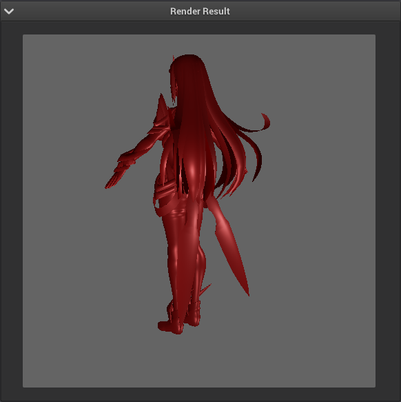
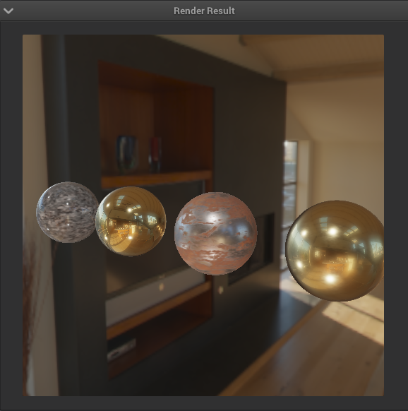
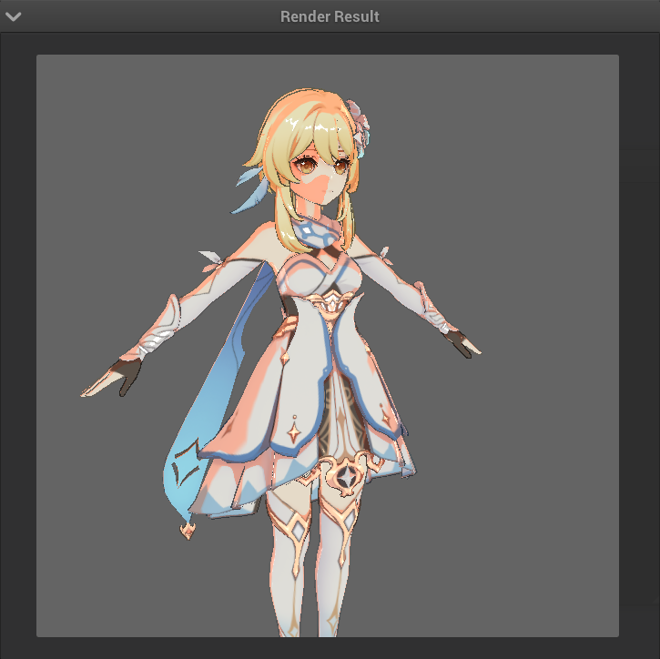
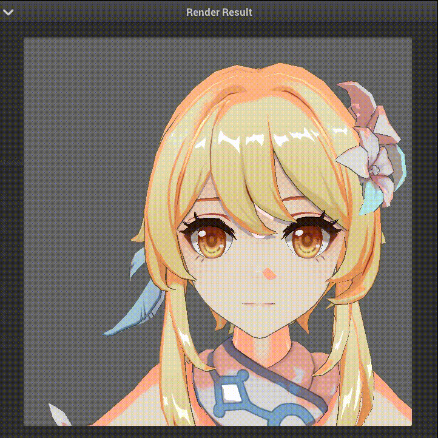
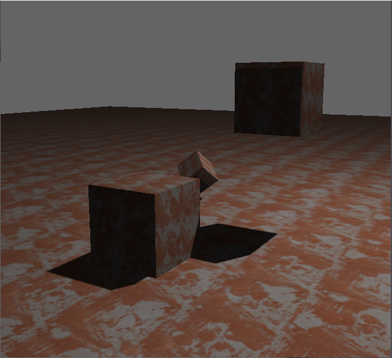
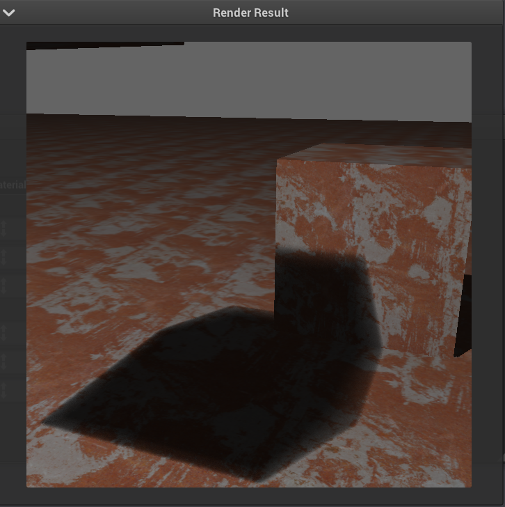

# Sora-PathTracer
基于OpenGL的实时渲染器

## PBR

通过改变粗糙度、金属度、反射率、光源等信息进行渲染

### Image Based Lighting

使渲染物体和环境更加贴合

## Non-Photorealistic Rendering

使用lightmap控制金属度、调整阴影阈值等信息，进而辅助渲染，通过面板控制二分色的主光源颜色和暗部颜色。能够控制描边粗细和线条颜色，控制方法可通过加载纹理也可通过面板直接控制，也可采样模型自身纹理生成颜色相近的描边线。

### 有向距离向量场和刘海阴影

使用有向距离向量场模拟面部光源的变化。

普通的shadowmap对刘海阴影模拟的精度不足。故使用模板测试模拟刘海阴影。可在面板调整刘海阴影颜色。

### 泛光

npr渲染多在边缘处产生较强的菲涅尔现象。通过光源和视角计算模型菲涅尔现象的强弱。超过阈值后通过调整rgba中的a通道模拟泛光效果。

## 阴影

### Shadow Map

### PCF阴影

### PCSS阴影

